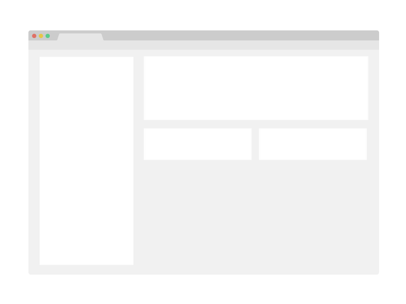

<br/>
<p align="center">
  <a href="https://github.com/The-Code-Monkey/styled-system">
    
  </a>
  
  <h1 align="center">Styled System</h1>

  <h3 align="center">Responsive, theme-based style props for building design systems with React</h3>

  <p align="center">
    Style props for rapid UI development
    <br/>
    <br/>
    <a href="https://github.com/The-Code-Monkey/styled-system"><strong>Explore the docs »</strong></a>
    <br/>
    <br/>
    <a href="https://github.com/The-Code-Monkey/styled-system/issues">Report Bug</a>
    -
    <a href="https://github.com/The-Code-Monkey/styled-system/issues">Request Feature</a>
  </p>
</p>

<div display="flex" align="center">
  
  
  
  
  
  
  
  
  
</div>

## Table Of Contents

* [About the Project](#about-the-project)
* [Built With](#built-with)
* [Getting Started](#getting-started)
  * [Installation](#installation)
* [Usage](#usage)
* [Roadmap](#roadmap)
* [Contributing](#contributing)
* [License](#license)
* [Authors](#authors)
* [Acknowledgements](#acknowledgements)

## About The Project



This is a continuation of the work done by jxnblk.

The project is a set of addons for styling and live updating components based on a prop architecture rather than using pure styled-components or other styling format.

## Built With

This project has been built using a couple of tools from my Techstack repo, feel free to check that out.

## Getting Started

To add this to your project follow the info below.

### Installation

```sh
npm install @techstack/styled-system
```

```sh
yarn add @techstack/styled-system
```

## Usage

I don't currently have my own version of the docs but the original ones should very closely match.

https://styled-system.com/

## Roadmap

See the [open issues](https://github.com/The-Code-Monkey/styled-system/issues) for a list of proposed features (and known issues).

## Contributing

Contributions are what make the open source community such an amazing place to be learn, inspire, and create. Any contributions you make are **greatly appreciated**.
* If you have suggestions for adding or removing projects, feel free to [open an issue](https://github.com/The-Code-Monkey/styled-system/issues/new) to discuss it, or directly create a pull request after you edit the *README.md* file with necessary changes.
* Please make sure you check your spelling and grammar.
* Create individual PR for each suggestion.
* Please also read through the [Code Of Conduct](https://github.com/The-Code-Monkey/styled-system/blob/main/CODE_OF_CONDUCT.md) before posting your first idea as well.

### Creating A Pull Request

1. Fork the Project
2. Create your Feature Branch (`git checkout -b feature/AmazingFeature`)
3. Commit your Changes (`git commit -m 'Add some AmazingFeature'`)
4. Push to the Branch (`git push origin feature/AmazingFeature`)
5. Open a Pull Request

## License

Distributed under the MIT License. See [LICENSE](https://github.com/The-Code-Monkey/styled-system/blob/main/LICENSE.md) for more information.

## Authors

* **Andrew Wilson** - *ReactJs Dev* - [Andrew Wilson](https://github.com/The-Code-Monkey/) - *Repo Owner*

## Acknowledgements

* [ImgShields](https://shields.io/)
